# 🫀 Wearable Health Monitoring & Emergency Alert System

A real-time IoT-enabled wearable solution for continuous monitoring of vital signs and emergency detection.  
The system is designed to provide **instant alerts** and **context-rich information** to caregivers, enabling rapid response and improved safety for vulnerable individuals.

---

## 🔧 Problem Statement
Current monitoring solutions lack **real-time**, **personalized**, and **inclusive** safety measures for individuals in need.  
This project addresses:
- Continuous monitoring of **Heart Rate (BPM)** and **SpO₂**.
- Immediate detection of emergencies through **voice keywords** and **SOS button**.
- Delivery of alerts enriched with images and data to caregivers.

---

## 📌 Solution Overview
The system integrates:
- **Wearable Device** (Seeed Studio Xiao ESP32S3 Sense) for vitals monitoring, voice detection, and image capture.
- **Edge AI Processing** (Raspberry Pi 1) for anomaly detection and keyword spotting.
- **Server** (Raspberry Pi 2) for centralized data storage and dashboard hosting.
- **Web Dashboard** (React-based) for real-time monitoring and historical data review.

---

## :electron: Hardware Components
- **Seeed Studio Xiao ESP32S3 Sense** — main controller for the wearable.
- **MAX30100** — BPM & SpO₂ sensor (I2C interface).
- **Push Button** — SOS trigger.
- **OLED Display** — real-time vitals display.
- **Raspberry Pi 3/4** — Edge AI node and backend server.

---

## 📁 Data Flow
1. **Wearable Device**  
   - Reads BPM & SpO₂.  
   - Captures audio for keyword spotting.  
   - Captures image upon trigger.  
   - Sends:
     - Vitals via MQTT.
     - Images/events via HTTP.

2. **Edge AI (RPi #1)**  
   - Detects anomalies (BPM, SpO₂).  
   - Detects keywords (“help”, “ouch”).  
   - Logs to Firebase and forwards alerts to server.

3. **Server (RPi #2)**  
   - Stores all user data (MariaDB).  
   - Hosts dashboard backend.

4. **Web Dashboard**  
   - Displays live data, alerts, and images.  
   - Allows retrospective analysis.

---

## 🗄️ Folder Structure

```bash

Wearable-Health-Monitoring-Emergency-Alert/
│
├── microcontroller/ # Seeed Studio Xiao ESP32S3 Sense
│ └── microcontroller_code/ # Firmware for wearable device
│
├── raspberry_pi_1/ # Raspberry Pi #1 (Edge AI Processing)
│ └── rpi1_edge_processing/ # Anomaly detection & keyword spotting
│
├── raspberry_pi_2/ # Raspberry Pi #2 (Backend Server)
│ └── rpi2_server/ # MariaDB & dashboard backend
│
├── web_dashboard/ # React-based health monitoring interface
│
├── docs/ # Documentation & diagrams
│ ├── architecture_diagram.png
│ ├── data_flow.png
│ └── IoT_project.pdf
│
└── README.md # Main project README
``` 

---

## Getting Started

### 1. Clone the Repository
```bash
git clone https://github.com/Sharankarthick/Wearable-Health-Monitoring-Emergency-Alert.git
cd Wearable-Health-Monitoring-Emergency-Alert
```

### 2. Microcontroller Setup

   1. Install Arduino IDE or PlatformIO.

   2. Select Seeed Studio Xiao ESP32S3 board.

   3. Upload code from microcontroller_code/.

### 3. Edge Processing (RPi #1)
```bash
cd rpi1_edge_processing
pip install -r requirements.txt
python main.py
```

### 4. Server (RPi #2)
```bash
cd rpi2_server
docker-compose up
```
### 5. Web Dashboard
```bash
cd web_dashboard
npm install
npm start
```
## Key Features
  - Real-time vital sign tracking.

  - Automatic anomaly detection and keyword-based triggers.

  - Instant alerts with images for better context.

  - Cloud integration for scalability.

  - Centralized monitoring for multiple users.

## Project Images

### CAD Design
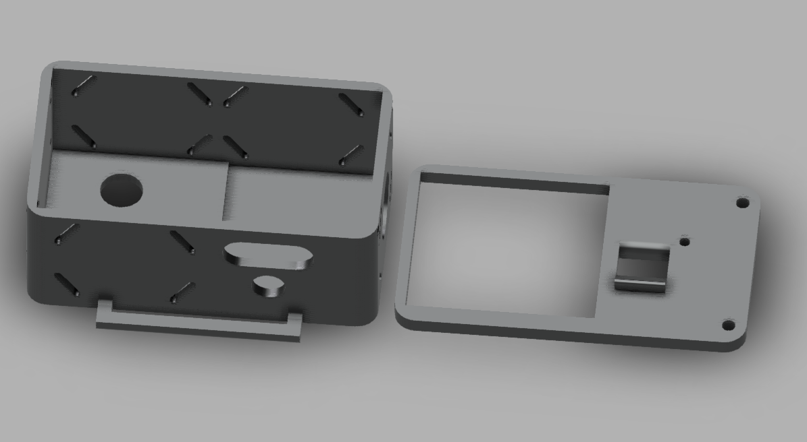

### Wearable Device
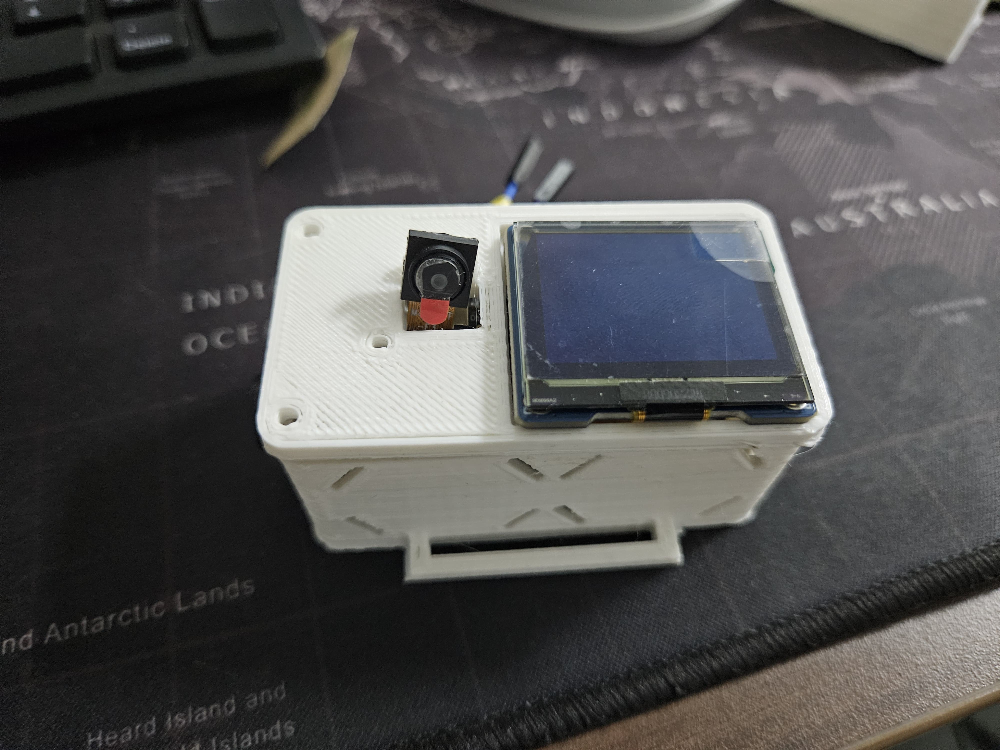
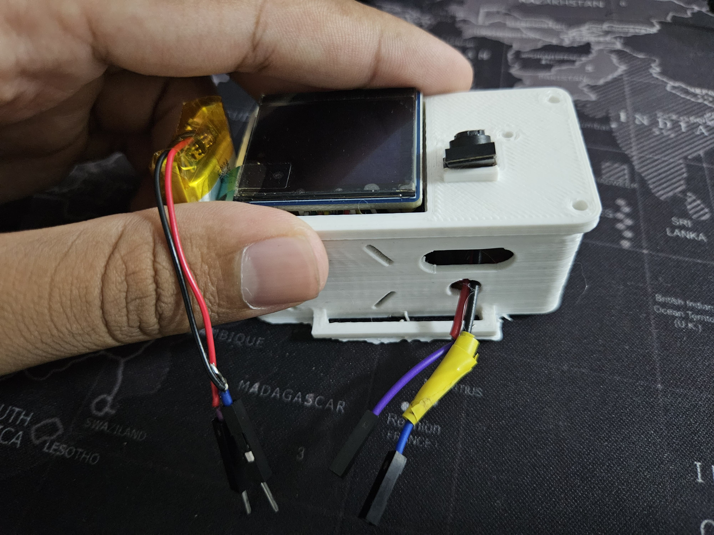
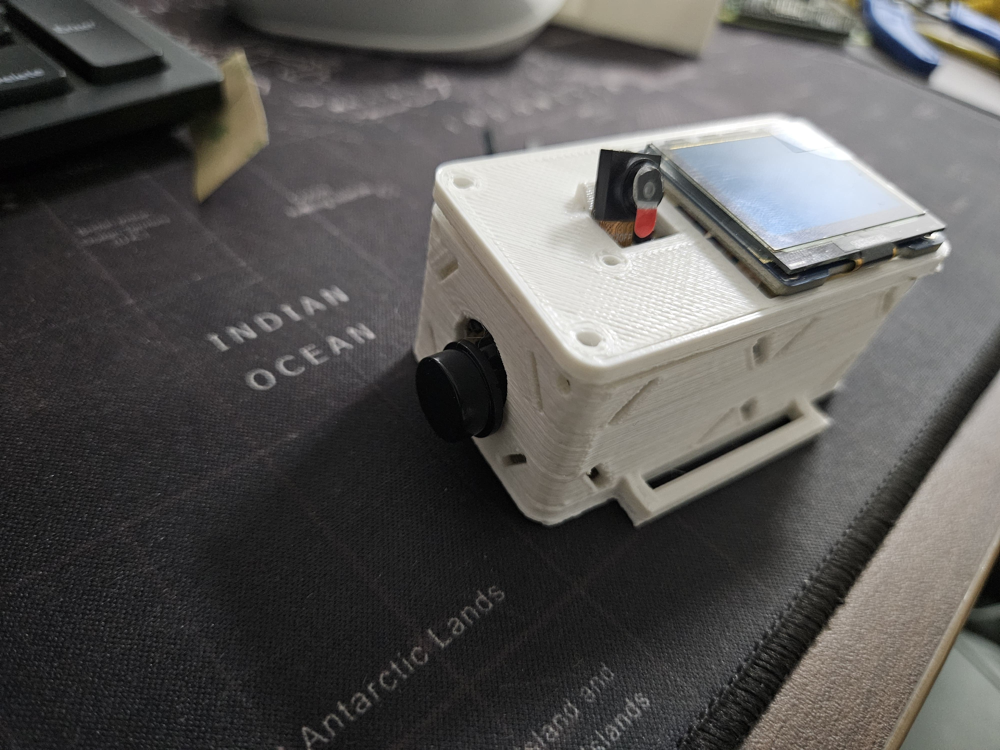

### Inside the Wearable
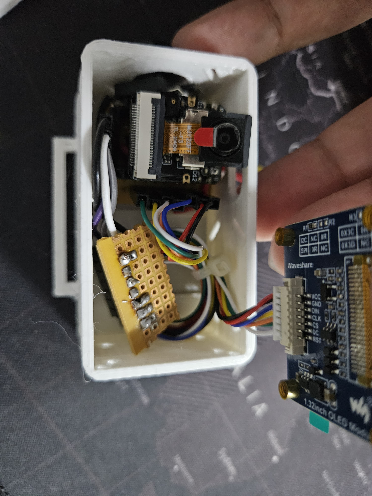

### 3D Printed Case

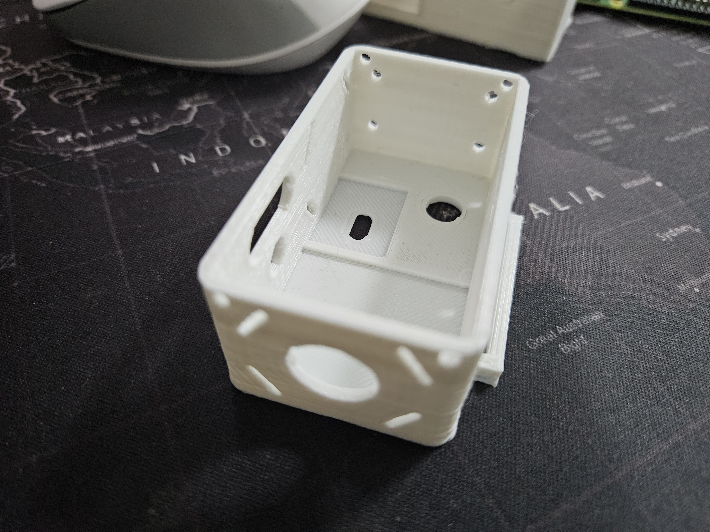

### Custom PCB Board

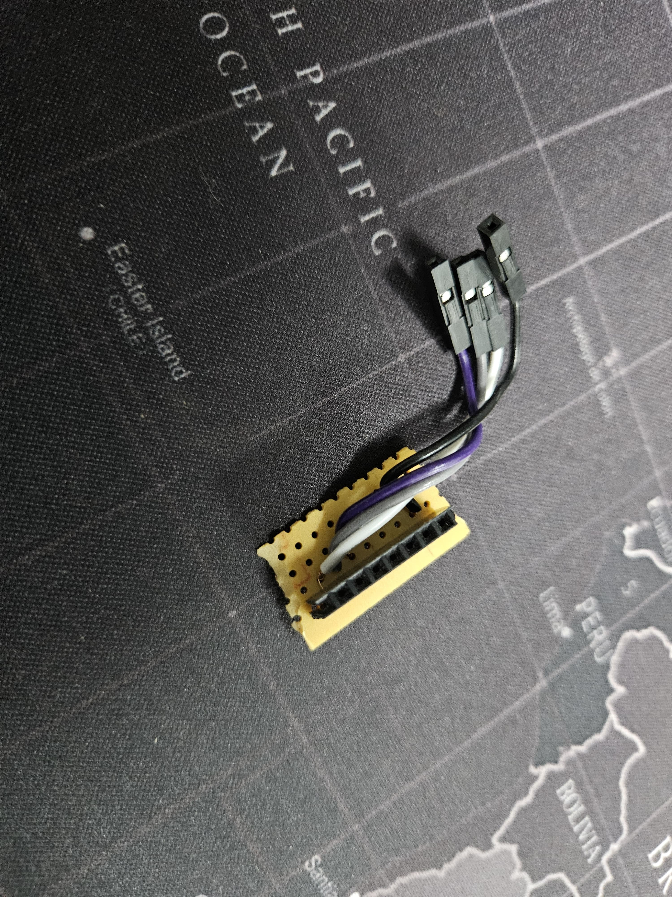

### Breadboard Prototype
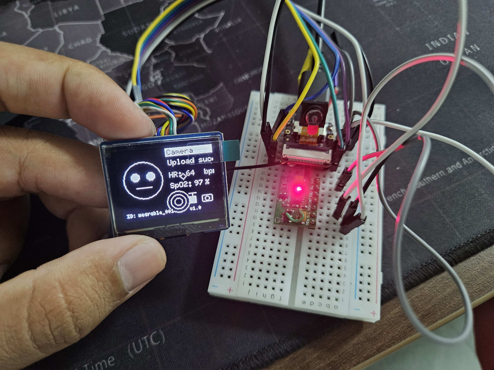
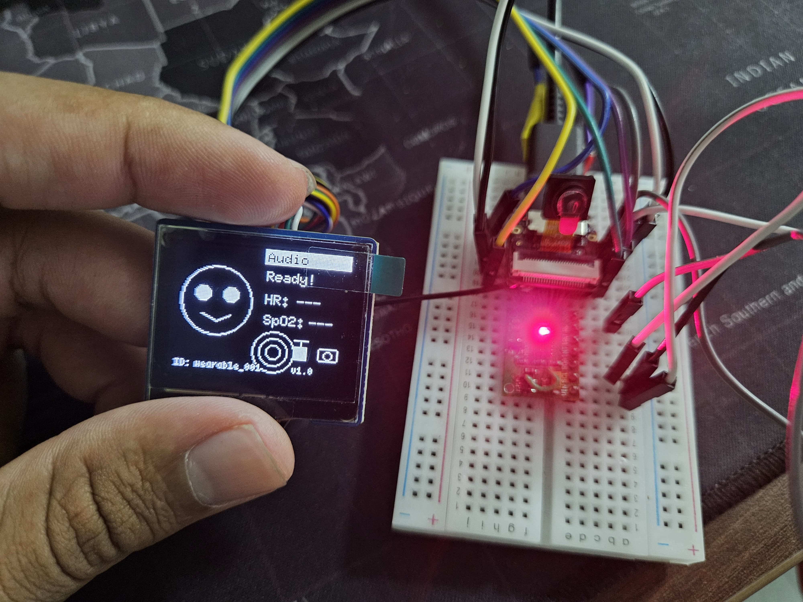

### Data Flow
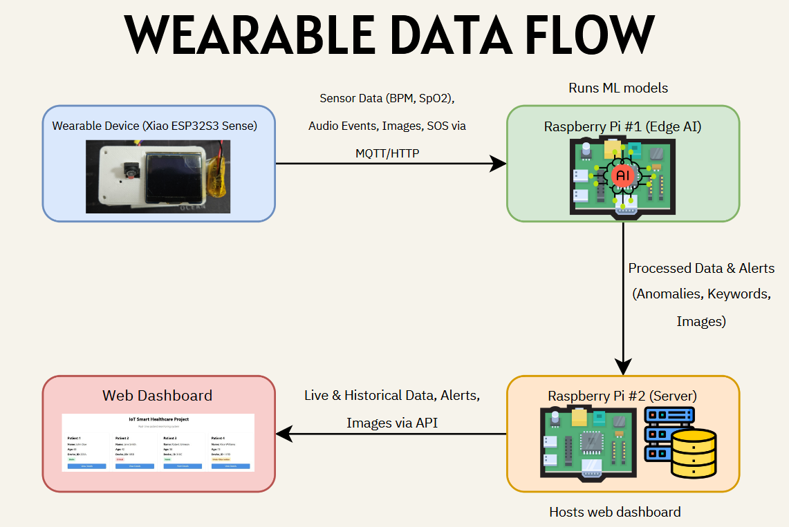

### Dashboard Screens
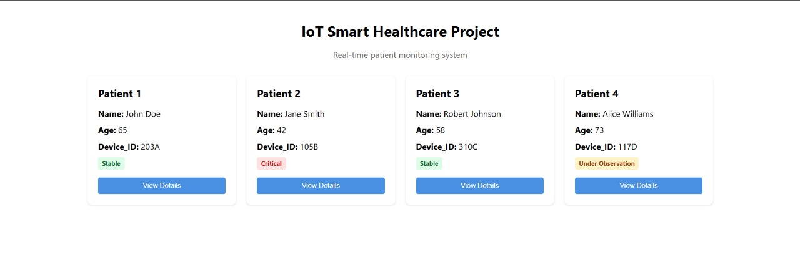
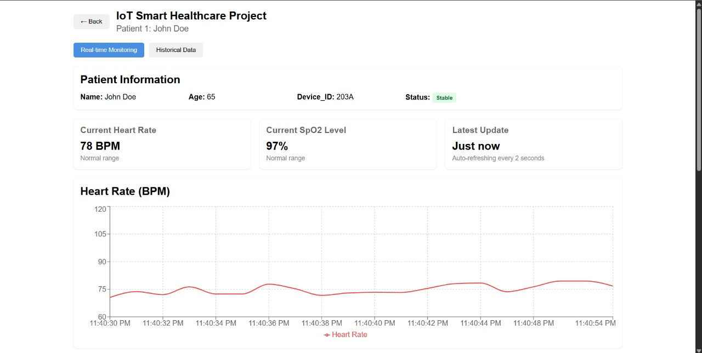

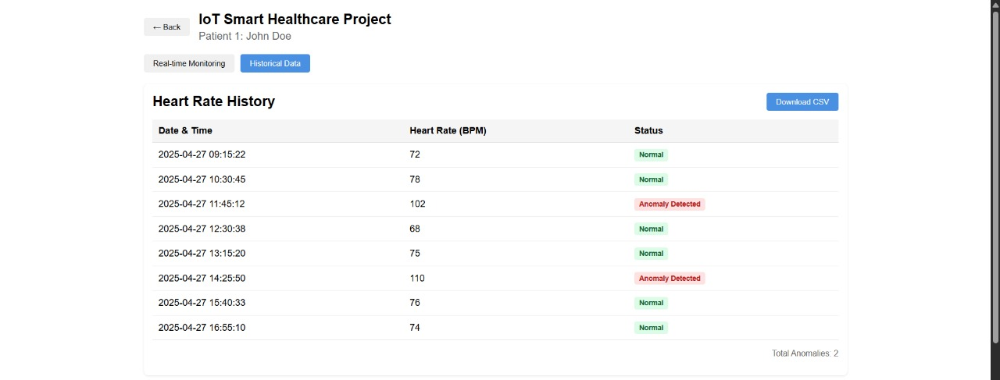
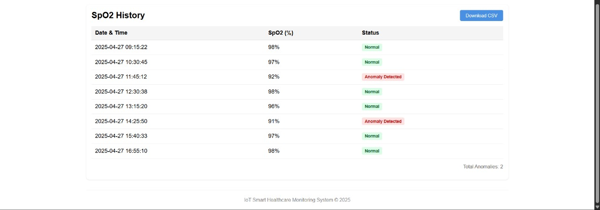

    
## ⚖️ License
MIT License

## 📬 Contact

**Sharan Karthick**  
📧 official.sharankarthick@gmail.com  
🔗 [LinkedIn](https://linkedin.com/in/sharan-karthick)  
🔗 [GitHub](https://github.com/Sharankarthick)

---
